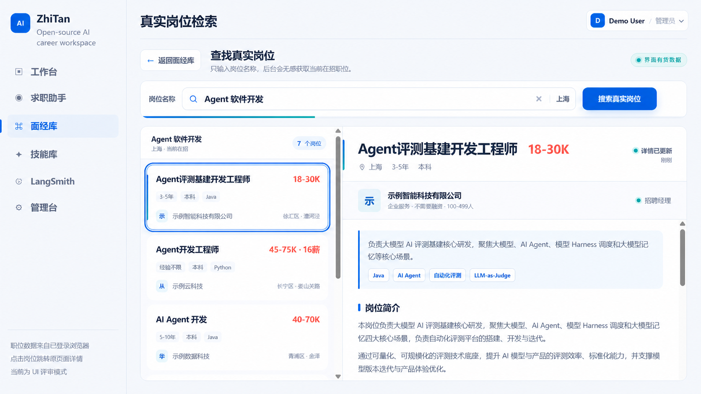
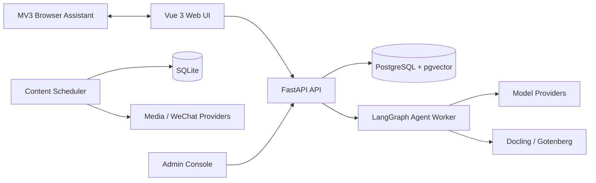

# ZhiTan

[](https://github.com/HBelike/ZhiTan/actions/workflows/ci.yml)
[](LICENSE)
[](https://www.python.org/)
[](https://vuejs.org/)

Open-source AI job-search and resume intelligence workbench.

[简体中文](README.zh-CN.md) · [Documentation](docs/) · [Contributing](CONTRIBUTING.md) · [Security](SECURITY.md)

ZhiTan brings the fragmented parts of a job search into one self-hosted workspace: understand a resume, compare it with a role, research current openings, build an interview knowledge base, and prepare for interviews with traceable AI workflows.



> ZhiTan is an early-stage project for assisted decision-making. Review generated content before using it, respect third-party platform rules, and never use it to misrepresent experience or bypass an assessment.

## What ZhiTan does

- **Career workspace** — conversational resume analysis, role matching, document intake, persistent career context, and configurable model connections.
- **Job library** — browse current openings through a user-controlled browser assistant, inspect job details, and prepare personalized outreach.
- **Interview library** — import, organize, search, and retrieve interview experiences with optional pgvector semantic recall.
- **Interview preparation** — browser-based live interview support, transcript archives, and a user-triggered online-assessment analysis workspace.
- **Provider-neutral AI** — connect OpenAI-compatible or supported cloud providers without placing API keys in browser code.
- **Operations and observability** — role-based administration, route switches, model context policies, LangSmith metadata tracing, and a Docker Compose production baseline.
- **Content workflow** — the repository also retains the original GitHub-trend and WeChat content pipeline as an independent module.

The Resume Assistant and Evaluation Center implementations are retained for future work, but their standalone pages are intentionally not mounted in the current navigation or route catalog.

## Quickstart with Docker Compose

### Prerequisites

- Docker Engine with Docker Compose v2
- A domain resolving to the host, with inbound ports `80` and `443` available
- At least one supported model-provider credential, configured after startup or through server-side environment variables

```bash
git clone https://github.com/HBelike/ZhiTan.git
cd ZhiTan
cp .env.production.example .env.production
```

Edit `.env.production` and, at minimum, replace:

```dotenv
APP_DOMAIN=jobs.example.com
PLATFORM_ADMIN_EMAIL=admin@example.com
CAREER_POSTGRES_PASSWORD=replace-with-a-long-random-password
```

Then validate and start the stack:

```bash
docker compose --env-file .env.production -f docker-compose.production.yml config --quiet
docker compose --env-file .env.production -f docker-compose.production.yml up -d --build
curl -fsS https://jobs.example.com/api/health
```

Create the first administrator from an interactive terminal. The password is never accepted as a command-line argument:

```bash
docker compose --env-file .env.production -f docker-compose.production.yml \
  exec -it career-api python scripts/bootstrap_first_admin.py
```

Optional document parsing can be enabled with the `document-processing` profile. See the [production deployment guide](docs/platform_production_deployment.md) before exposing an instance to the internet.

## Local development

ZhiTan uses PostgreSQL for career and identity data, while the independent content workflow retains SQLite for its local state.

```bash
python -m venv .venv
python -m pip install -r requirements.txt -r requirements-career-assistant.txt -r requirements-development.txt
cp .env.career-assistant.example .env.career-assistant
docker compose --env-file .env.career-assistant -f docker-compose.career-assistant.yml up -d
python -m alembic upgrade head
```

Start the API and agent worker in separate terminals:

```bash
python preview_server.py
python scripts/run_career_agent_worker.py
```

On Windows, `scripts\start_dev_backend.ps1` starts both processes. Start the web client separately:

```bash
npm --prefix web-ui ci
npm --prefix web-ui run dev
```

Open `http://127.0.0.1:5173/career`.

Run the main checks with:

```bash
python -m pytest -q
npm --prefix web-ui test
npm --prefix web-ui run build
npm --prefix browser-extension/job-library test
```

## Architecture



| Area | Main paths | Responsibility |
|---|---|---|
| Web application | `web-ui/` | Vue routes, career workspace, libraries, admin console |
| API and access | `src/web/`, `src/platform_access/` | HTTP boundary, identity, sessions, module policy |
| Career intelligence | `src/career_assistant/` | Agent graph, resume intake, matching, memory, retrieval |
| Browser assistant | `browser-extension/job-library/` | User-triggered reading of supported browser pages |
| Content pipeline | `src/tasks/`, `src/providers/`, `src/scheduler/` | GitHub discovery, article/media production, draft delivery |
| Operations | `migrations/`, `docker/`, `docker-compose*.yml` | Schema history, services, deployment topology |

Architecture decisions and module-level call chains are documented under [`docs/`](docs/).

## Configuration and secrets

- Copy an `*.example` file; never commit a real `.env` file.
- `PLATFORM_ADMIN_EMAIL` controls the bootstrap administrator identity.
- `ZHITAN_APP_ORIGIN` is injected into production browser-extension packages; no deployment domain is stored in extension source.
- Model, email, storage, WeChat, and observability credentials are read server-side from environment variables or encrypted provider records.
- The checked-in examples contain placeholders only. If a real key is ever committed, revoke it before removing it from Git history.

See [`config/app.yaml`](config/app.yaml), [`config/career_assistant.yaml`](config/career_assistant.yaml), and the example environment files for supported settings.

## Browser assistant

The MV3 extension acts as a local bridge to pages the user is already viewing. It does not export cookies or passwords, and assessment support does not write or submit answers. To build a package for your deployment:

```powershell
$env:ZHITAN_APP_ORIGIN = 'https://jobs.example.com'
python scripts/package_boss_extension.py
```

Review the [extension guide](browser-extension/job-library/README.md) and [responsible-use policy](SAFETY.md) before enabling it.

## Project status

ZhiTan is a developer preview. Interfaces, migrations, and deployment assumptions may change. Open an issue for reproducible bugs and discuss substantial feature changes before investing in a large pull request.

## Contributing

Contributions are welcome. Start with [CONTRIBUTING.md](CONTRIBUTING.md), follow the [Code of Conduct](CODE_OF_CONDUCT.md), and include tests and documentation for behavior changes.

Security issues should follow [SECURITY.md](SECURITY.md), not a public issue.

## License

Original ZhiTan code is licensed under the [Apache License 2.0](LICENSE). Bundled fonts, referenced implementations, container images, and dependencies retain their respective licenses; see [THIRD_PARTY_NOTICES.md](THIRD_PARTY_NOTICES.md).
