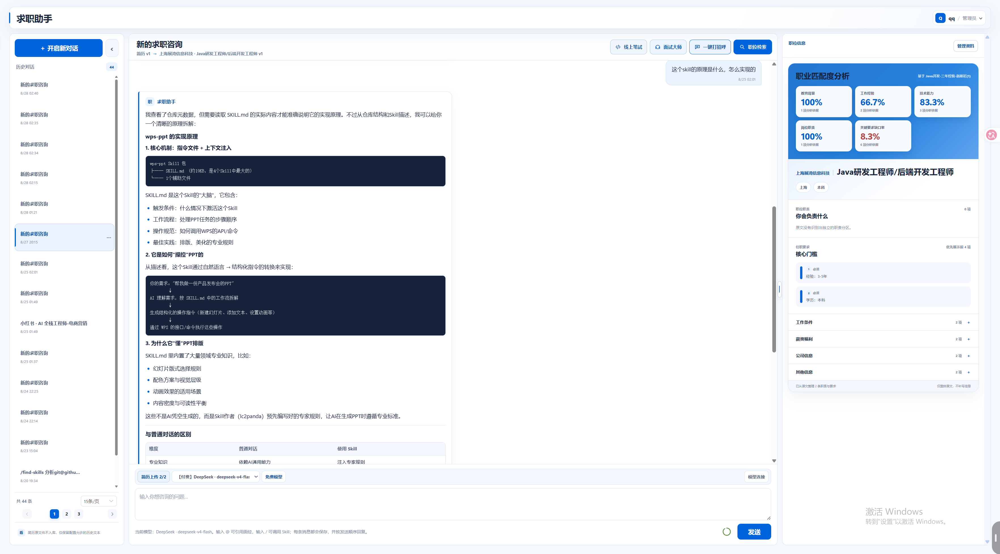
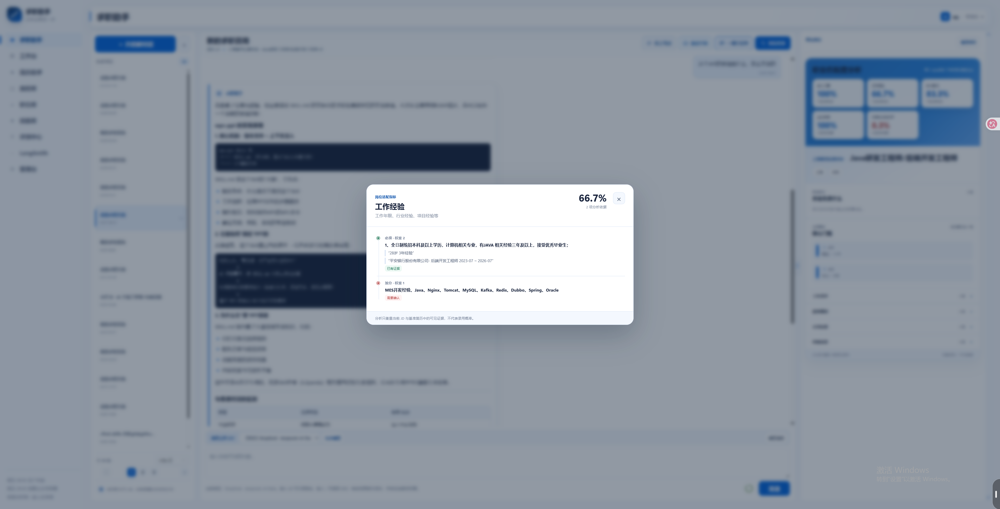
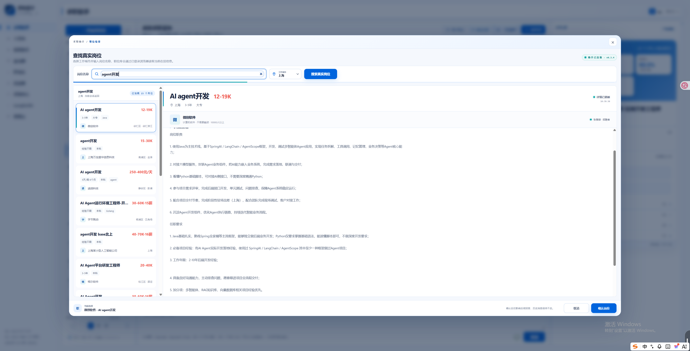
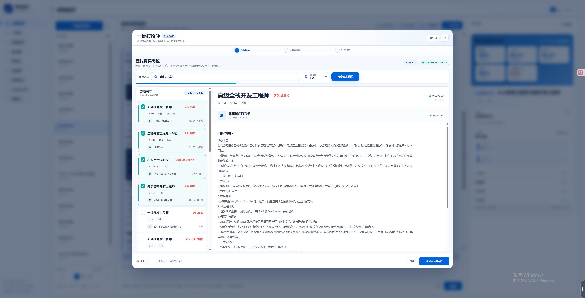
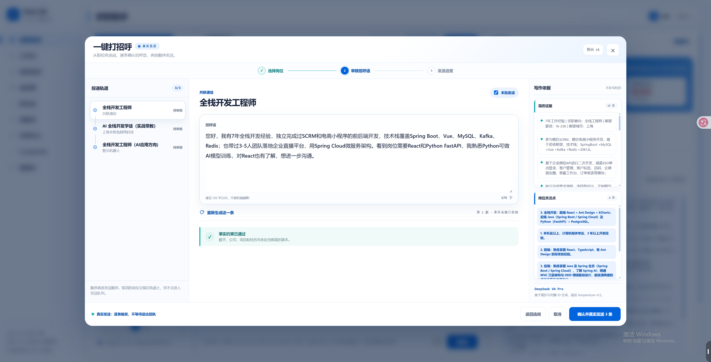
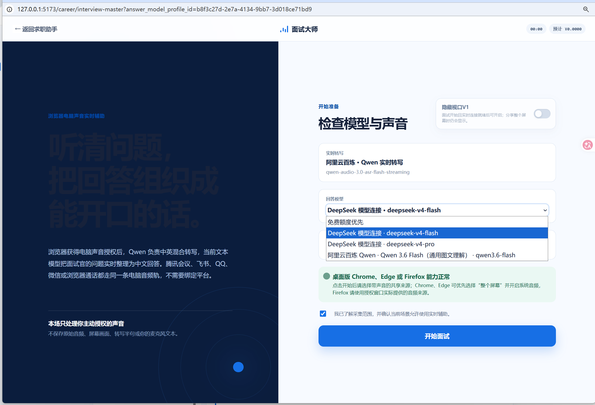
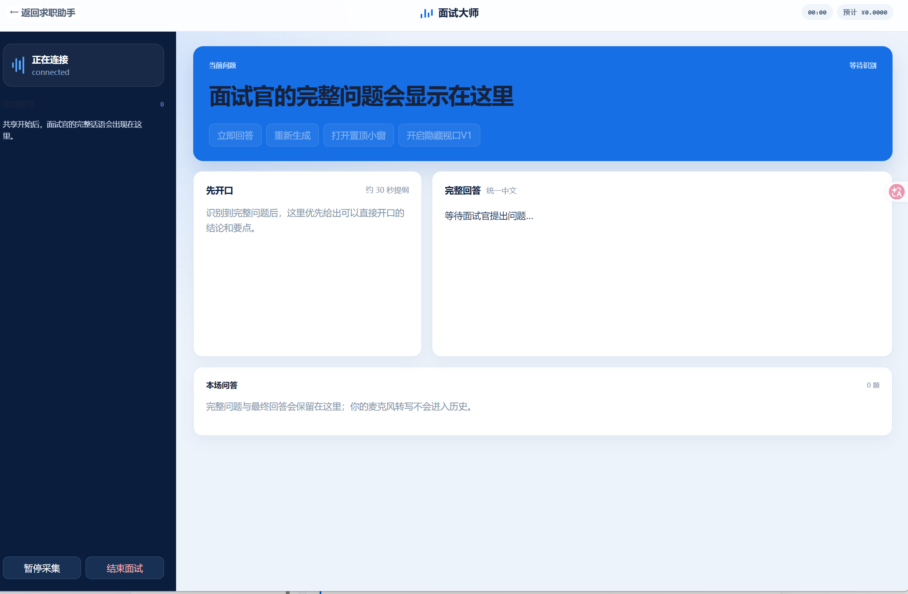

# ZhiTan

[](https://github.com/HBelike/ZhiTan/actions/workflows/ci.yml)
[](LICENSE)

ZhiTan is an open-source job-search workspace for candidates. It turns resumes, job descriptions, public interview material, and ongoing conversations into a persistent workflow for job discovery, fit analysis, outreach, and interview preparation.

The core localhost stack starts without model, email, Firecrawl, LangSmith, Docling, or media-provider credentials. Provider-backed actions stay unavailable until configured; account bootstrap, password login, navigation, and system configuration remain usable.

## Core capabilities

- persistent candidate profiles, resumes, conversations, and job records;
- job discovery and structured job-library workflows;
- resume-to-role fit analysis and evidence-backed recommendations;
- greeting generation and browser-assistant integration;
- interview-material collection and live interview support;
- encrypted per-user model credentials and configurable provider profiles.

The resume assistant, evaluation center, and workbench implementations remain in the repository for future development, but their public routes are not mounted.

## Product walkthrough

ZhiTan is designed as one connected workflow: understand the candidate, compare that evidence with real roles, turn the match into outreach, and stay useful when the interview begins.

### 1. Work with a persistent career assistant

The assistant keeps conversations, selected resumes, job context, and model configuration together. A live role-fit panel keeps the current target visible while the candidate asks questions or plans the next step.

[](docs/assets/product/career-assistant.png)

### 2. Inspect resume-to-role fit by evidence

Instead of returning one opaque score, ZhiTan breaks fit analysis into dimensions such as education, experience, skills, seniority, and keyword coverage. Each detail view shows which resume evidence supports a requirement and which gaps still need attention.

[](docs/assets/product/resume-fit-analysis.png)

### 3. Discover real job postings

Job discovery searches supported public sources and returns the original role details for review. Candidates can compare salary, location, experience, employer, responsibilities, and requirements before adding a role to their workflow.

[](docs/assets/product/live-job-discovery.png)

### 4. Review personalized greetings before batch outreach

The batch workflow separates selection from generation and dispatch. Candidates choose several relevant roles, generate a greeting from resume evidence and the selected job description, review every message, and explicitly confirm before sending.

<p align="center">
  <a href="docs/assets/product/batch-greeting-role-selection.png"></a>
  <a href="docs/assets/product/batch-greeting-review.png"></a>
</p>

### 5. Turn a live interview question into an answer draft

With explicit user authorization, the interview copilot transcribes system audio in real time and organizes the complete question. It then uses the configured model to prepare a concise opening and a structured answer. The setup and active-session screens keep audio scope, provider choice, connection state, and session history visible.

<p align="center">
  <a href="docs/assets/product/live-interview-setup.png"></a>
  <a href="docs/assets/product/live-interview-assistant.png"></a>
</p>

> [!NOTE]
> Screenshots come from a development environment and contain sample candidate and job data. Live job discovery, model-backed generation, email, and streaming speech recognition require their corresponding provider credentials.

## Five-minute localhost Quickstart

Requirements: Git, Docker Desktop or Docker Engine with Compose v2, and Python 3.12 or 3.13 for the cross-platform setup helper.

Windows PowerShell:

```powershell
git clone https://github.com/HBelike/ZhiTan.git
Set-Location ZhiTan
.\scripts\setup_quickstart.ps1 -NonInteractive
docker compose --env-file .env.quickstart up -d --build --wait
docker compose --env-file .env.quickstart exec career-api python scripts/bootstrap_first_admin.py
Invoke-RestMethod http://127.0.0.1:18081/api/ready
```

Linux or macOS:

```bash
git clone https://github.com/HBelike/ZhiTan.git
cd ZhiTan
./scripts/setup_quickstart.sh
docker compose --env-file .env.quickstart up -d --build --wait
docker compose --env-file .env.quickstart exec career-api python scripts/bootstrap_first_admin.py
curl --fail http://127.0.0.1:18081/api/ready
```

Open <http://127.0.0.1:18081>, then sign in with the administrator email shown by the bootstrap screen and the password entered in the terminal.

Only Web is published to the host:

```dotenv
ZHITAN_HTTP_PORT=18081
```

PostgreSQL, API, migration, and Worker remain inside the Compose network. Compose derives resource names from the clone directory or `COMPOSE_PROJECT_NAME`, so separate clones do not share containers or data volumes.

Stop the instance while retaining data:

```bash
docker compose --env-file .env.quickstart down
```

Permanently delete this instance's Compose volumes:

```bash
docker compose --env-file .env.quickstart down -v
```

`down -v` is destructive. It removes the current Compose project's PostgreSQL, application-data, Skill, and credential-key volumes.

## Architecture

```text
Browser -> Nginx Web -> FastAPI -> PostgreSQL/pgvector
                             |
                             +-> persistent Agent Worker

PostgreSQL healthy -> Alembic migration completed -> API/Worker ready -> Web ready
```

- `/api/health` is process liveness.
- `/api/ready` checks PostgreSQL, Alembic head, and writable application storage.
- The default stack excludes Caddy, Scheduler, Gotenberg, Docling, and Skill seeds.
- Production and document services are added through Compose overlays.

## Documentation

- [Getting started](docs/getting-started.md)
- [Local development](docs/local-development.md)
- [Production deployment](docs/production-deployment.md)
- [Troubleshooting](docs/troubleshooting.md)
- [Contributing](CONTRIBUTING.md)
- [Security policy](SECURITY.md)
- [Safety boundaries](SAFETY.md)

## Project status

ZhiTan is a developer preview. The `master` branch is the current supported source line and is gated by Python, Web, browser-extension, build, Compose, migration, readiness, Worker, and real-login checks.

## License

ZhiTan is licensed under [Apache License 2.0](LICENSE). Third-party packages, container images, and optional integrations retain their own licenses; see [THIRD_PARTY_NOTICES.md](THIRD_PARTY_NOTICES.md).
