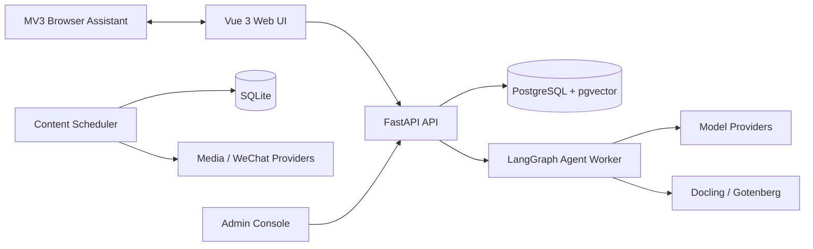

# ZhiTan

[](https://github.com/HBelike/ZhiTan/actions/workflows/ci.yml)
[](LICENSE)
[](https://www.python.org/)
[](https://vuejs.org/)

面向求职与简历理解的开源 AI 工作台。

[English](README.md) · [项目文档](docs/) · [参与贡献](CONTRIBUTING.md) · [安全策略](SECURITY.md)

ZhiTan 把分散的求职任务放进一个可自托管工作区：理解简历、对照岗位、检索当前职位、沉淀面经，并通过可追踪的 AI 流程完成面试准备。


> ZhiTan 目前处于早期阶段，只用于辅助判断。使用生成内容前请人工审核，遵守第三方平台规则，不得用它虚构经历或绕过评测。

## 核心能力

- **求职工作区**：对话式简历分析、岗位匹配、文档解析、职业上下文和可配置模型连接。
- **职位库**：通过用户主动控制的浏览器助手读取当前职位、查看完整 JD，并生成个性化沟通文案。
- **面经库**：导入、整理、检索面试经历，并可用 pgvector 增强语义召回。
- **面试准备**：浏览器端实时面试辅助、问答归档，以及由用户主动触发的线上笔试分析工作区。
- **Provider 解耦**：后端接入 OpenAI-compatible 或已支持的云服务，API Key 不进入浏览器代码。
- **管理与观测**：角色管理、路由开关、模型上下文策略、LangSmith 元数据观测和 Docker Compose 生产基线。
- **内容工作流**：仓库还保留独立的 GitHub 热门项目与公众号内容流水线。

工作台、简历助手和评测中心的实现代码仍然保留，供后续优化；当前版本只取消了它们的独立页面路由和导航挂载，旧 `/review` 地址统一回到求职助手。

## Docker Compose 快速开始

### 前置条件

- Docker Engine 与 Docker Compose v2
- 已解析到服务器的域名，且 `80`、`443` 端口可用
- 至少一个可用模型服务凭据，可在启动后通过页面配置或由服务端环境变量注入

```bash
git clone https://github.com/HBelike/ZhiTan.git
cd ZhiTan
cp .env.production.example .env.production
```

编辑 `.env.production`，至少替换以下配置：

```dotenv
APP_DOMAIN=jobs.example.com
PLATFORM_ADMIN_EMAIL=admin@example.com
CAREER_POSTGRES_PASSWORD=replace-with-a-long-random-password
```

校验并启动：

```bash
docker compose --env-file .env.production -f docker-compose.production.yml config --quiet
docker compose --env-file .env.production -f docker-compose.production.yml up -d --build
curl -fsS https://jobs.example.com/api/health
```

在交互式终端创建首个管理员。脚本不会通过命令行参数读取密码：

```bash
docker compose --env-file .env.production -f docker-compose.production.yml \
  exec -it career-api python scripts/bootstrap_first_admin.py
```

文档解析服务可通过 `document-processing` profile 按需启用。公开部署前请先阅读[生产部署文档](docs/platform_production_deployment.md)。

## 本地开发

ZhiTan 使用 PostgreSQL 保存求职与账号数据；独立内容工作流继续用 SQLite 保存本地状态。

```bash
python -m venv .venv
python -m pip install -r requirements.txt -r requirements-career-assistant.txt -r requirements-development.txt
cp .env.career-assistant.example .env.career-assistant
docker compose --env-file .env.career-assistant -f docker-compose.career-assistant.yml up -d
python -m alembic upgrade head
```

分别启动 API 与 Agent Worker：

```bash
python preview_server.py
python scripts/run_career_agent_worker.py
```

Windows 可用 `scripts\start_dev_backend.ps1` 同时启动二者。前端单独启动：

```bash
npm --prefix web-ui ci
npm --prefix web-ui run dev
```

访问 `http://127.0.0.1:5173/career`。

主要验证命令：

```bash
python -m pytest -q
npm --prefix web-ui test
npm --prefix web-ui run build
npm --prefix browser-extension/job-library test
```

## 架构



| 区域 | 主要目录 | 职责 |
|---|---|---|
| Web 应用 | `web-ui/` | Vue 路由、求职工作区、资料库、管理台 |
| API 与访问控制 | `src/web/`、`src/platform_access/` | HTTP 边界、身份、会话、模块策略 |
| 求职智能 | `src/career_assistant/` | Agent Graph、简历解析、匹配、记忆、检索 |
| 浏览器助手 | `browser-extension/job-library/` | 用户主动触发的受支持页面读取 |
| 内容流水线 | `src/tasks/`、`src/providers/`、`src/scheduler/` | GitHub 发现、图文音视频、草稿投递 |
| 工程运维 | `migrations/`、`docker/`、`docker-compose*.yml` | Schema 历史、服务和部署拓扑 |

详细架构决策与模块调用链位于 [`docs/`](docs/)。

## 配置与密钥

- 只复制 `*.example` 文件，不要提交真实 `.env`。
- `PLATFORM_ADMIN_EMAIL` 指定 bootstrap 管理员身份。
- `ZHITAN_APP_ORIGIN` 在生产扩展打包时注入，扩展源码不保存实际部署域名。
- 模型、邮件、存储、微信和观测凭据只由服务端读取，或以加密的 Provider 记录保存。
- 仓库示例仅包含占位值。如果真实密钥曾进入 Git，请先吊销，再处理历史记录。

可配置项见 [`config/app.yaml`](config/app.yaml)、[`config/career_assistant.yaml`](config/career_assistant.yaml) 和环境变量示例文件。

## 浏览器助手

MV3 扩展是用户当前浏览页面与 ZhiTan 之间的本地桥接。它不导出 Cookie 或密码，线上笔试能力也不会填写或提交答案。为自己的部署打包：

```powershell
$env:ZHITAN_APP_ORIGIN = 'https://jobs.example.com'
python scripts/package_boss_extension.py
```

启用前请阅读[扩展说明](browser-extension/job-library/README.md)与[负责任使用政策](SAFETY.md)。

## 项目状态

ZhiTan 当前为 Developer Preview，接口、迁移和部署假设仍可能调整。可复现问题请提交 Issue；较大的功能改动建议先讨论，再投入完整实现。

## 参与贡献

欢迎贡献。开始前请阅读 [CONTRIBUTING.md](CONTRIBUTING.md) 和 [CODE_OF_CONDUCT.md](CODE_OF_CONDUCT.md)，行为变更应同步补充测试与文档。

安全问题请按 [SECURITY.md](SECURITY.md) 私下报告，不要提交公开 Issue。

## 许可证

ZhiTan 原创代码使用 [Apache License 2.0](LICENSE)。随仓库分发的字体、参考实现、容器镜像和依赖继续适用各自许可证，详见 [THIRD_PARTY_NOTICES.md](THIRD_PARTY_NOTICES.md)。
